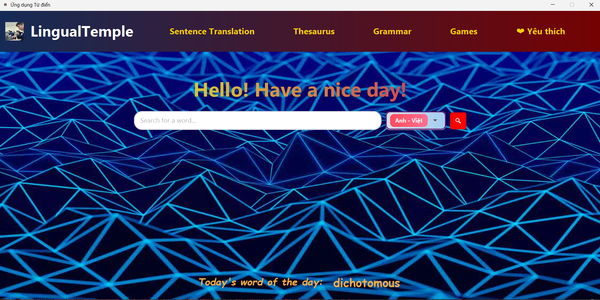
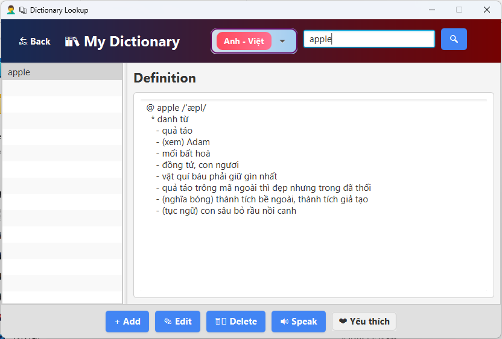

# 📖LingualTemple (Ứng dụng học tiếng Anh)

 ## Entries:
 - [Developers](#những-người-phát-triển-app)
 - [Introduction](#giới-thiệu-chung)
 - [Features](#chức-năng-chính)
 - [UML Diagram](#biểu-đồ-uml)
 - [How to use](#demo)
 - [Future Updates](#phát-triển-trong-tương-lai)
 - [Installation](#cách-cài-đặt)
 - [Notes](#ghi-chú)
 ## 👷‍♂️Những người phát triển app:

Dev team UETèo bao gồm:
- 😁Nguyễn Bảo Duy (aseancoin1967)    24022312
- 💀Trịnh Tuấn Hải (TrinhTuanHai)   24022318
- 😈Hoàng Huy Hoàng (HoangGlorious)   24022336

 ## ℹ️ Giới thiệu chung 

- LingualTemple là ngôi đền để bạn trau dồi những kiến thức cơ bản về tiếng Anh.
- Ở đây, bạn có thể tra cứu từ vựng, học ngữ pháp, thậm chí là trau dồi thêm nguồn từ đồng và trái nghĩa
để phục vụ cho việc học IELTS của bạn (hoặc bạn có thể tra Cambridge nếu muốn chắc chắn).
- Ứng dụng này được Develop bằng ngôn ngữ Java mà chúng ta rất thích (thử cãi trước mặt anh Tuyên xem), và 
giao diện thì được xây bằng JavaFX.
- Từ điển này còn có tích hợp game Wordle cho những bạn cảm thấy việc vừa học vừa chơi là phong cách của mình.
- 
 ## 🌟Chức năng chính

Câc chức năng chính của LingualTemple như sau:

- Tìm từ có đề xuất: Mỗi khi các bạn nhập vào thanh tìm kiếm, sẽ có danh sách Recommendation hiện ra để giúp việc tìm kiếm thuận tiện hơn.
- Thêm từ: Bạn có thể thêm những từ mà bạn muốn vào từ điển, với đầy đủ những đặc tính của từ như từ loại, định nghĩa và 1 số ví dụ.
- Sửa từ: Bạn có thể sửa những từ mà bạn cảm thấy chưa đúng, hay thêm 1 định nghĩa khác cho các từ đã tồn tại trong từ điển.
- Xóa từ: Bạn có thể xóa 1 từ khỏi từ điển (nếu muốn, bọn mình cũng không biết ai lại thù oán 1 từ gì đấy đến mức muốn xóa nó đi).
- Phát âm từ: Nút phát âm từ sẽ phát âm từ mà bạn đang xem trên giao diện từ điển (sử dụng Google Translate API).
- Dịch câu (Eng-Vie và Vie-Eng): Màn hình dịch câu sẽ giúp bạn dịch các câu chưa hiểu mà bạn gặp trong tra cứu thông tin trên mạng, hay giúp bạn biểu đạt bằng tiếng Anh (Qua API của Google Translate).
- Từ đồng nghĩa và trái nghĩa (Thesaurus): Mỗi khi bạn tìm từ trong chế độ thesaurus, ứng dụng sẽ cho bạn các từ đồng nghĩa và trái nghĩa mà bạn có thể click vào để xem Thesaurus của từ bạn click (chức năng này sử dụng FreeDictionaryAPI).
- Grammar: Ứng dụng có các cấu trúc câu và các thì cơ bản với đầy đủ cách dùng, ví dụ,... để giúp các bạn làm chủ các khía cạnh cơ bản của tiếng Anh.
- Game Wordle: Implementation của game Wordle nổi tiếng, giúp bạn thử thách vốn từ vựng của mình và có thể là tìm ra được những từ mới.
- Word Of The Day: Mỗi ngày, màn hình chính sẽ chọn 1 từ ngẫu nhiên làm WOTD.
  
 ## Biểu đồ UML

- Biểu đồ UML của app như sau:
  

 ## ▶️Demo
- Video hướng dẫn sử dụng ở https://youtu.be/2fYFR6KXUco

 ## 🚀Phát triển trong tương lai

- Thêm nhiều từ và từ điển hơn.
- Thêm game thứ 2.
- Phát triển thêm các chức năng khác.

 ## ⚙️Cách cài đặt

- Clone project từ repo về máy.
- Mở trong IntelliJ.
- Tìm đến file DictionaryApplication.java và run (hoặc tạo configuration).

## 📝Ghi chú
- Dự án có tham khảo cách thiết kế và chuyển scene từ AI và Google.
- File từ điển gốc của dự án được lấy từ https://github.com/yenthanh132/avdict-database-sqlite-converter.

